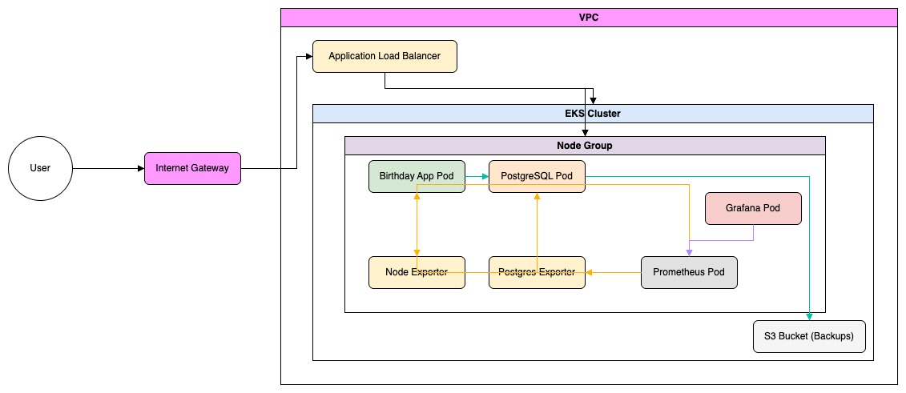
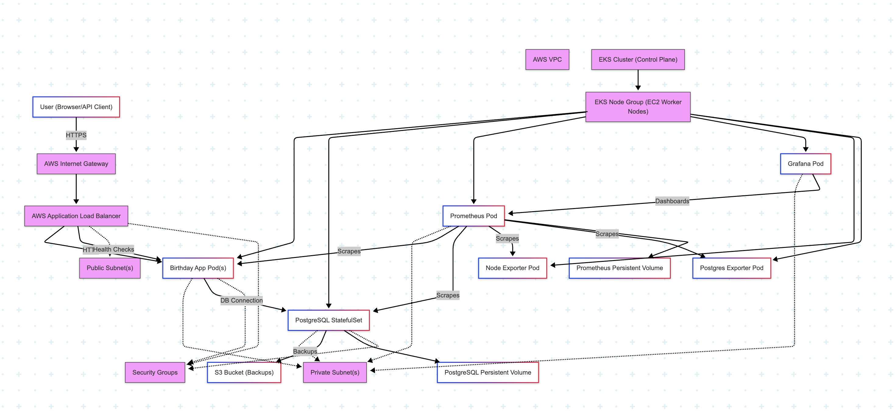

# Birthday API - Highly Available Application

A production-ready birthday greeting API with highly available PostgreSQL deployment on AWS EKS.

## Features

- RESTful API for managing user birthdays
- Highly available PostgreSQL with streaming replication
- Zero-downtime deployments
- Automatic scaling based on load
- Comprehensive monitoring and logging
- Cross-region disaster recovery
- Security best practices

## Architecture

The application is deployed on AWS EKS with the following components:

- **Application**: Node.js API deployed as Kubernetes Deployment with HPA
- **Database**: PostgreSQL StatefulSet with 1 primary and 2 read replicas
- **Load Balancing**: AWS Application Load Balancer
- **Storage**: EBS volumes for database persistence, S3 for backups
- **Monitoring**: Prometheus metrics and CloudWatch logs
- **Disaster Recovery**: Cross-region S3 replication for backups

## System Architecture



## Application data flow



## API Endpoints

### Save/Update Birthday
```
PUT /hello/<username>
Content-Type: application/json

{
  "dateOfBirth": "YYYY-MM-DD"
}

Response: 204 No Content
```

**Validation:**
- `username` must contain only letters
- `dateOfBirth` must be in YYYY-MM-DD format and before today

### Get Birthday Message
```
GET /hello/<username>

Response: 200 OK
{
  "message": "Hello, <username>! Your birthday is in N day(s)"
}
```

### Health Endpoints
- `GET /health/live` - Liveness probe
- `GET /health/ready` - Readiness probe
- `GET /health` - Detailed health information
- `GET /metrics` - Prometheus metrics

## Local Development

### Prerequisites
- Node.js 18+
- Docker and Docker Compose
- PostgreSQL client (optional)

### Setup

1. Clone the repository:
```bash
git clone <repository-url>
cd revolut
```

2. Install dependencies:
```bash
npm install
```

3. Copy environment variables:
```bash
cp env.example .env
```

4. Start services with Docker Compose:
```bash
docker-compose up -d
```

5. Run tests:
```bash
npm test
```

6. Access the application:
- API: http://localhost:3000
- Prometheus: http://localhost:9090
- Grafana: http://localhost:3001 (admin/admin)

### Development Commands
```bash
npm run dev          # Start in development mode with hot reload
npm test            # Run all tests
npm run test:unit   # Run unit tests only
npm run test:integration # Run integration tests
npm run lint        # Run ESLint
npm run migrate     # Run database migrations
```

## Production Deployment

### Prerequisites
- AWS CLI configured
- kubectl configured for EKS cluster
- Docker
- Kustomize

### Initial Setup

1. Create EKS cluster:
```bash
eksctl create cluster --name birthday-app-cluster --region us-east-1
```

2. Install AWS Load Balancer Controller:
```bash
kubectl apply -k "github.com/aws/eks-charts/stable/aws-load-balancer-controller/crds"
helm install aws-load-balancer-controller eks/aws-load-balancer-controller \
  -n kube-system \
  --set clusterName=birthday-app-cluster
```

3. Create S3 bucket for backups:
```bash
aws s3 mb s3://birthday-app-backups --region us-east-1
```

### Deploy Application

1. Build and push Docker image:
```bash
export ECR_REPO=<your-ecr-repo>
./scripts/deploy.sh prod v1.0.0
```

2. The deployment script will:
   - Build and test the Docker image
   - Push to ECR
   - Deploy PostgreSQL StatefulSet
   - Deploy the application
   - Configure autoscaling
   - Set up ingress

### Database Operations

#### Backup
```bash
./scripts/backup-postgres.sh
```

This creates a backup and uploads it to S3 with automatic retention.

#### Restore
```bash
kubectl exec -n birthday-app postgres-0 -- bash -c "
  aws s3 cp s3://birthday-app-backups/backups/<backup-file> /tmp/
  gunzip /tmp/<backup-file>
  PGPASSWORD=\$POSTGRES_PASSWORD psql -U \$POSTGRES_USER -d \$POSTGRES_DB < /tmp/<backup-file.sql>
"
```

### Monitoring

1. Access Prometheus:
```bash
kubectl port-forward -n monitoring svc/prometheus 9090:9090
```

2. Access Grafana:
```bash
kubectl port-forward -n monitoring svc/grafana 3000:3000
```

### Scaling

The application automatically scales based on CPU and memory usage. To manually scale:

```bash
# Scale application
kubectl scale deployment birthday-app -n birthday-app --replicas=10

# Scale PostgreSQL replicas (read-only)
kubectl scale statefulset postgres -n birthday-app --replicas=5
```

## High Availability Features

### Database
- **Primary-Replica Setup**: 1 primary for writes, 2+ replicas for reads
- **Streaming Replication**: Real-time data synchronization
- **Automatic Failover**: Promoted replica becomes primary if needed
- **Connection Pooling**: Efficient connection management
- **Read/Write Split**: Automatic routing of queries

### Application
- **Multiple Replicas**: Minimum 3 pods across availability zones
- **Health Checks**: Automatic restart of unhealthy pods
- **Graceful Shutdown**: 30-second termination grace period
- **Circuit Breaker**: Automatic retry with exponential backoff
- **Rate Limiting**: Protection against abuse

### Infrastructure
- **Multi-AZ Deployment**: Pods distributed across availability zones
- **Auto-scaling**: HPA based on CPU/memory metrics
- **Load Balancing**: AWS ALB with health checks
- **Persistent Storage**: EBS volumes with snapshots

## Disaster Recovery

### Backup Strategy
- **Automated Backups**: Daily PostgreSQL backups to S3
- **Cross-Region Replication**: S3 bucket replication to DR region
- **Point-in-Time Recovery**: Using PostgreSQL WAL archives
- **Retention Policy**: 30-day backup retention

### Recovery Procedures

1. **Zone Failure**: Automatic failover to healthy zones
2. **Region Failure**: 
   - Deploy infrastructure in DR region
   - Restore from latest S3 backup
   - Update Route53 to point to DR region

### RTO/RPO Targets
- **RTO (Recovery Time Objective)**: < 1 hour
- **RPO (Recovery Point Objective)**: < 24 hours

## Security

- **Network Policies**: Restricted pod-to-pod communication
- **Secrets Management**: Kubernetes secrets for sensitive data
- **TLS/SSL**: Encrypted communication (HTTPS)
- **Non-root Containers**: Security-hardened images
- **RBAC**: Role-based access control
- **Input Validation**: Strict validation of all inputs

## Troubleshooting

### Common Issues

1. **Database Connection Failed**
```bash
# Check PostgreSQL pods
kubectl get pods -n birthday-app -l app=postgres

# Check logs
kubectl logs -n birthday-app postgres-0
```

2. **Application Not Starting**
```bash
# Check application pods
kubectl get pods -n birthday-app -l app=birthday-app

# Check logs
kubectl logs -n birthday-app -l app=birthday-app
```

3. **High Memory Usage**
```bash
# Check resource usage
kubectl top pods -n birthday-app
```

### Debug Commands
```bash
# Get all resources
kubectl get all -n birthday-app

# Describe pod
kubectl describe pod <pod-name> -n birthday-app

# Execute commands in pod
kubectl exec -it <pod-name> -n birthday-app -- /bin/sh

# Check events
kubectl get events -n birthday-app --sort-by='.lastTimestamp'
```

## License

MIT License 